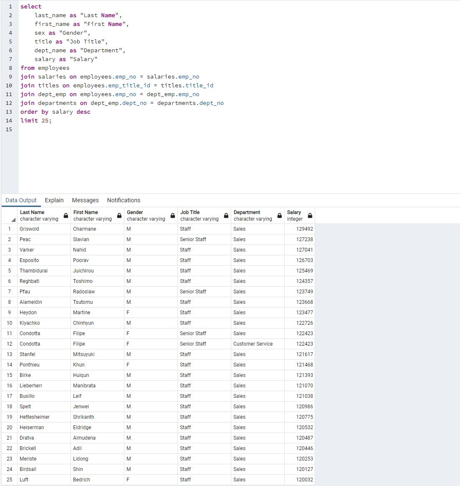

<h1> Who Is Paid The Most?   (Examples of Building Tables and Executing Queries in SQL) </h1>

#### Overview:

#### Folders/Files:
* **"SQL Queries"** (folder)  
	- *"table_setups.sql"* (schemata for creating the tables in postgresql)  
	- *"employee_queries.sql"* (several examples of postgresql queries)  
 * **"Data Files"** (folder)  
	- *"departments.csv"* (input data file if needed)  
	- *"dept_emp.csv"* (input data file if needed)  
	- *"dept_manager.csv"* (input data file if needed)  
	- *"employees.csv"* (input data file if needed)  
	- *"salaries.csv"* (input data file if needed)  
	- *"titles.csv"* (input data file if needed)  
* **"Analysis Code"** (folder)  
	- *"SalaryAnalysis.ipynb"* (jupyter notebook file containing code for further salary analysis)  
* **"Images"** (folder)  
	- *"TableRelationshipDiagram.png"* (table relationship diagram)  
	
#### Note:  
The csv files in subfolder *"data"* are only needed if re-building the tables from scratch.  
The Jupyter notebook requires you to either hardcode your postgresql password into the cell where indicated
or put your postgresql password into a config.py file before running.  

#### Entity Relationship Diagram:
 
  

#### Query To Show Top 25 Paid Employees:

  

#### Query To Show Top 5 Paid Employees in Each Department:

  

